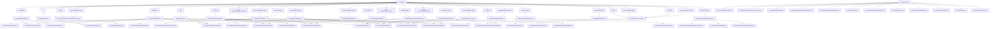

# Repo Connectivity Graph

Generated: 2026-03-05T01:32:06.950Z

```mermaid
graph TD
  APP["src/App.tsx"]
  SERVER["server/index.cjs"]
  APP --> ROUTE__["/"]
  ROUTE__ --> PAGE_src_pages_Home_tsx["src/pages/Home.tsx"]
  APP --> ROUTE__login["/login"]
  ROUTE__login --> PAGE_src_pages_Login_tsx["src/pages/Login.tsx"]
  APP --> ROUTE__onboarding["/onboarding"]
  ROUTE__onboarding --> PAGE_src_pages_Onboarding_tsx["src/pages/Onboarding.tsx"]
  APP --> ROUTE__dashboard["/dashboard"]
  ROUTE__dashboard --> PAGE_src_pages_Dashboard_tsx["src/pages/Dashboard.tsx"]
  APP --> ROUTE__planner__grade__subject["/planner/:grade/:subject"]
  ROUTE__planner__grade__subject --> PAGE_src_components_planner_StudyPlannerView_tsx["src/components/planner/StudyPlannerView.tsx"]
  APP --> ROUTE__planner["/planner"]
  ROUTE__planner --> PAGE_src_components_planner_StudyPlannerView_tsx["src/components/planner/StudyPlannerView.tsx"]
  APP --> ROUTE__topics__topicKey["/topics/:topicKey"]
  ROUTE__topics__topicKey --> PAGE_src_pages_TopicHub_tsx["src/pages/TopicHub.tsx"]
  APP --> ROUTE__topic_hub__grade__subject["/topic-hub/:grade/:subject"]
  ROUTE__topic_hub__grade__subject --> PAGE_src_pages_TopicHub_tsx["src/pages/TopicHub.tsx"]
  APP --> ROUTE__topic_hub__grade__subject__topicKey["/topic-hub/:grade/:subject/:topicKey"]
  ROUTE__topic_hub__grade__subject__topicKey --> PAGE_src_pages_TopicHub_tsx["src/pages/TopicHub.tsx"]
  APP --> ROUTE__topic_hub["/topic-hub"]
  ROUTE__topic_hub --> PAGE_src_pages_TopicHubHome_tsx["src/pages/TopicHubHome.tsx"]
  APP --> ROUTE__trends__grade__subject["/trends/:grade/:subject"]
  ROUTE__trends__grade__subject --> PAGE_src_pages_TrendsPage_tsx["src/pages/TrendsPage.tsx"]
  APP --> ROUTE__mock_paper__slug["/mock-paper/:slug"]
  ROUTE__mock_paper__slug --> PAGE_src_pages_MockPaper_tsx["src/pages/MockPaper.tsx"]
  APP --> ROUTE__mock_builder__grade__subject["/mock-builder/:grade/:subject"]
  ROUTE__mock_builder__grade__subject --> PAGE_src_pages_MockBuilder_tsx["src/pages/MockBuilder.tsx"]
  APP --> ROUTE__mock_builder["/mock-builder"]
  ROUTE__mock_builder --> PAGE_src_pages_MockBuilder_tsx["src/pages/MockBuilder.tsx"]
  APP --> ROUTE__highly_probable__grade__subject["/highly-probable/:grade/:subject"]
  ROUTE__highly_probable__grade__subject --> PAGE_src_pages_HighlyProbableQuestions_tsx["src/pages/HighlyProbableQuestions.tsx"]
  APP --> ROUTE__highly_probable["/highly-probable"]
  ROUTE__highly_probable --> PAGE_src_pages_HighlyProbableQuestions_tsx["src/pages/HighlyProbableQuestions.tsx"]
  APP --> ROUTE__predictive_papers["/predictive-papers"]
  ROUTE__predictive_papers --> PAGE_src_pages_PredictivePapers_tsx["src/pages/PredictivePapers.tsx"]
  APP --> ROUTE__practice__grade__subject["/practice/:grade/:subject"]
  ROUTE__practice__grade__subject --> PAGE_src_pages_PracticePage_tsx["src/pages/PracticePage.tsx"]
  APP --> ROUTE__study_plan__grade__subject["/study-plan/:grade/:subject"]
  ROUTE__study_plan__grade__subject --> PAGE_src_pages_StudyPlanPage_tsx["src/pages/StudyPlanPage.tsx"]
  APP --> ROUTE__study_plan["/study-plan"]
  ROUTE__study_plan --> PAGE_src_pages_StudyPlanPage_tsx["src/pages/StudyPlanPage.tsx"]
  APP --> ROUTE__ai_mentor__grade__subject["/ai-mentor/:grade/:subject"]
  ROUTE__ai_mentor__grade__subject --> PAGE_src_pages_AiMentorPage_tsx["src/pages/AiMentorPage.tsx"]
  APP --> ROUTE__ai_mentor["/ai-mentor"]
  ROUTE__ai_mentor --> PAGE_src_pages_AiMentorPage_tsx["src/pages/AiMentorPage.tsx"]
  APP --> ROUTE__mentor__grade__subject["/mentor/:grade/:subject"]
  ROUTE__mentor__grade__subject --> PAGE_src_pages_AiMentorPage_tsx["src/pages/AiMentorPage.tsx"]
  APP --> ROUTE__mentor["/mentor"]
  ROUTE__mentor --> PAGE_src_pages_AiMentorPage_tsx["src/pages/AiMentorPage.tsx"]
  APP --> ROUTE__daily_mix__grade__subject["/daily-mix/:grade/:subject"]
  ROUTE__daily_mix__grade__subject --> PAGE_src_pages_DailyMixPage_tsx["src/pages/DailyMixPage.tsx"]
  APP --> ROUTE__play__sessionId["/play/:sessionId"]
  ROUTE__play__sessionId --> PAGE_src_pages_SessionPlayPage_tsx["src/pages/SessionPlayPage.tsx"]
  APP --> ROUTE__weekly_wrapped["/weekly-wrapped"]
  ROUTE__weekly_wrapped --> PAGE_src_pages_WeeklyWrappedPage_tsx["src/pages/WeeklyWrappedPage.tsx"]
  APP --> ROUTE__["*"]
  PAGE_src_components_planner_StudyPlannerView_tsx --> DEP_src_engine_studyPlanner_ts["src/engine/studyPlanner.ts"]
  PAGE_src_pages_AiMentorPage_tsx --> DEP_src_components_BackLink_tsx["src/components/BackLink.tsx"]
  PAGE_src_pages_AiMentorPage_tsx --> DEP_src_components_MentorPanel_tsx["src/components/MentorPanel.tsx"]
  PAGE_src_pages_DailyMixPage_tsx --> DEP_src_components_DailyMixWidget_tsx["src/components/DailyMixWidget.tsx"]
  PAGE_src_pages_DailyMixPage_tsx --> DEP_src_context_vibeModeContext_tsx["src/context/vibeModeContext.tsx"]
  PAGE_src_pages_Dashboard_tsx --> DEP_src_context_AuthContext_tsx["src/context/AuthContext.tsx"]
  PAGE_src_pages_Dashboard_tsx --> DEP_src_context_ProfileContext_tsx["src/context/ProfileContext.tsx"]
  PAGE_src_pages_Dashboard_tsx --> DEP_src_context_vibeModeContext_tsx["src/context/vibeModeContext.tsx"]
  PAGE_src_pages_Dashboard_tsx --> DEP_src_engine_smartLearningStore_tsx["src/engine/smartLearningStore.tsx"]
  PAGE_src_pages_Dashboard_tsx --> DEP_src_engine_smartLearningTypes_ts["src/engine/smartLearningTypes.ts"]
  PAGE_src_pages_Dashboard_tsx --> DEP_src_services_cbseExamDate_ts["src/services/cbseExamDate.ts"]
  PAGE_src_pages_HighlyProbableQuestions_tsx --> DEP_src_components_question_QuestionVisualAid_tsx["src/components/question/QuestionVisualAid.tsx"]
  PAGE_src_pages_HighlyProbableQuestions_tsx --> DEP_src_components_ux_JourneyStrip_tsx["src/components/ux/JourneyStrip.tsx"]
  PAGE_src_pages_HighlyProbableQuestions_tsx --> DEP_src_components_ux_ReturnContextBar_tsx["src/components/ux/ReturnContextBar.tsx"]
  PAGE_src_pages_HighlyProbableQuestions_tsx --> DEP_src_engine_smartLearningStore_tsx["src/engine/smartLearningStore.tsx"]
  PAGE_src_pages_HighlyProbableQuestions_tsx --> DEP_src_engine_smartLearningTypes_ts["src/engine/smartLearningTypes.ts"]
  PAGE_src_pages_HighlyProbableQuestions_tsx --> DEP_src_services_uxTelemetry_ts["src/services/uxTelemetry.ts"]
  PAGE_src_pages_Home_tsx --> DEP_src_context_AuthContext_tsx["src/context/AuthContext.tsx"]
  PAGE_src_pages_Login_tsx --> DEP_src_context_AuthContext_tsx["src/context/AuthContext.tsx"]
  PAGE_src_pages_Login_tsx --> DEP_src_context_vibeModeContext_tsx["src/context/vibeModeContext.tsx"]
  PAGE_src_pages_Login_tsx --> DEP_src_services_firebaseClient_ts["src/services/firebaseClient.ts"]
  PAGE_src_pages_Login_tsx --> DEP_src_services_sessionApi_ts["src/services/sessionApi.ts"]
  PAGE_src_pages_Login_tsx --> DEP_src_services_uxTelemetry_ts["src/services/uxTelemetry.ts"]
  PAGE_src_pages_MockPaper_tsx --> DEP_src_components_question_QuestionVisualAid_tsx["src/components/question/QuestionVisualAid.tsx"]
  PAGE_src_pages_Onboarding_tsx --> DEP_src_context_ProfileContext_tsx["src/context/ProfileContext.tsx"]
  PAGE_src_pages_Onboarding_tsx --> DEP_src_services_cbseExamDate_ts["src/services/cbseExamDate.ts"]
  PAGE_src_pages_PracticePage_tsx --> DEP_src_components_question_QuestionVisualAid_tsx["src/components/question/QuestionVisualAid.tsx"]
  PAGE_src_pages_PracticePage_tsx --> DEP_src_components_ux_JourneyStrip_tsx["src/components/ux/JourneyStrip.tsx"]
  PAGE_src_pages_PracticePage_tsx --> DEP_src_components_ux_ReturnContextBar_tsx["src/components/ux/ReturnContextBar.tsx"]
  PAGE_src_pages_PracticePage_tsx --> DEP_src_services_mentorServerGate_ts["src/services/mentorServerGate.ts"]
  PAGE_src_pages_PracticePage_tsx --> DEP_src_services_uxTelemetry_ts["src/services/uxTelemetry.ts"]
  PAGE_src_pages_SessionPlayPage_tsx --> DEP_src_components_SessionPlayer_tsx["src/components/SessionPlayer.tsx"]
  PAGE_src_pages_SessionPlayPage_tsx --> DEP_src_services_sessionApi_ts["src/services/sessionApi.ts"]
  PAGE_src_pages_TopicHub_tsx --> DEP_src_components_DiagramBlock_tsx["src/components/DiagramBlock.tsx"]
  PAGE_src_pages_TopicHub_tsx --> DEP_src_components_tutor_TutorDrawerV2_tsx["src/components/tutor/TutorDrawerV2.tsx"]
  PAGE_src_pages_TopicHub_tsx --> DEP_src_components_ux_JourneyStrip_tsx["src/components/ux/JourneyStrip.tsx"]
  PAGE_src_pages_TopicHub_tsx --> DEP_src_components_ux_ReturnContextBar_tsx["src/components/ux/ReturnContextBar.tsx"]
  PAGE_src_pages_TopicHub_tsx --> DEP_src_context_vibeModeContext_tsx["src/context/vibeModeContext.tsx"]
  PAGE_src_pages_TopicHub_tsx --> DEP_src_services_mentorServerGate_ts["src/services/mentorServerGate.ts"]
  PAGE_src_pages_TopicHubHome_tsx --> DEP_src_components_auth_RequireAuth_tsx["src/components/auth/RequireAuth.tsx"]
  PAGE_src_pages_TopicHubHome_tsx --> DEP_src_engine_smartLearningStore_tsx["src/engine/smartLearningStore.tsx"]
  PAGE_src_pages_TopicHubHome_tsx --> DEP_src_engine_smartLearningTypes_ts["src/engine/smartLearningTypes.ts"]
  PAGE_src_pages_TopicHubHome_tsx --> DEP_src_services_sessionApi_ts["src/services/sessionApi.ts"]
  PAGE_src_pages_TopicHubHome_tsx --> DEP_src_services_topicHubMastery_ts["src/services/topicHubMastery.ts"]
  PAGE_src_pages_TrendsPage_tsx --> DEP_src_components_ux_JourneyStrip_tsx["src/components/ux/JourneyStrip.tsx"]
  PAGE_src_pages_TrendsPage_tsx --> DEP_src_components_ux_ReturnContextBar_tsx["src/components/ux/ReturnContextBar.tsx"]
  PAGE_src_pages_TrendsPage_tsx --> DEP_src_engine_smartLearningStore_tsx["src/engine/smartLearningStore.tsx"]
  PAGE_src_pages_TrendsPage_tsx --> DEP_src_engine_smartLearningTypes_ts["src/engine/smartLearningTypes.ts"]
  PAGE_src_pages_TrendsPage_tsx --> DEP_src_services_uxTelemetry_ts["src/services/uxTelemetry.ts"]
  PAGE_src_pages_WeeklyWrappedPage_tsx --> DEP_src_components_WeeklyWrappedCarousel_tsx["src/components/WeeklyWrappedCarousel.tsx"]
  PAGE_src_pages_WeeklyWrappedPage_tsx --> DEP_src_services_practiceInsights_ts["src/services/practiceInsights.ts"]
  PAGE_src_pages_WeeklyWrappedPage_tsx --> DEP_src_services_weeklyWrappedGenerator_ts["src/services/weeklyWrappedGenerator.ts"]
  SERVER --> BACK_src_contracts_tutorContracts_ts["src/contracts/tutorContracts.ts"]
  SERVER --> BACK_src_data_bsre_triangles_bsre_rubrics_v1_json["src/data/bsre/triangles_bsre_rubrics_v1.json"]
  SERVER --> BACK_src_engine_bsre_evaluator_ts["src/engine/bsre/evaluator.ts"]
  SERVER --> BACK_src_prompts_grind_trianglesGrindContract_ts["src/prompts/grind/trianglesGrindContract.ts"]
  SERVER --> BACK_src_tutor_diagram_diagramTemplates_ts["src/tutor/diagram/diagramTemplates.ts"]
  SERVER --> BACK_src_tutor_hintLadder_ts["src/tutor/hintLadder.ts"]
  SERVER --> BACK_src_tutor_retrieval_trianglesRetriever_ts["src/tutor/retrieval/trianglesRetriever.ts"]
  SERVER --> BACK_src_tutor_rubricScore_ts["src/tutor/rubricScore.ts"]
  SERVER --> BACK_src_tutor_topicTeachContracts_ts["src/tutor/topicTeachContracts.ts"]
  SERVER --> BACK_server_sessionHandlers_cjs["server/sessionHandlers.cjs"]
  SERVER --> BACK_server_telemetry_cjs["server/telemetry.cjs"]
  SERVER --> BACK_server_tutorOrchestrator_cjs["server/tutorOrchestrator.cjs"]
```
