# Repo Functionality and Connectivity Audit

Generated: 2026-03-05T01:32:06.950Z

## Snapshot

- Files scanned (src/server/scripts/tools): 258
- Local dependency edges: 388
- Unresolved local imports: 2
- Frontend routes in App shell: 28
- Backend endpoint conditions discovered: 15
- Frontend files with explicit /api calls: 4

## Project Understanding

LazyTopper is a CBSE-focused adaptive study platform with a React web app and a Node gateway. The frontend routes cover onboarding, dashboard, Topic Hub tutor journeys, practice/session playback, daily mix, weekly wrapped, and predictive/mock surfaces. The backend provides mentor generation, session APIs, tutor feedback intake, and health/meta utilities.

## High-Level Functionality Areas

### Auth and Identity

- Login, auth gating, Firebase initialization, and user/session identity context.
- Routes: /dashboard, /login, /onboarding
- Key files (5):
  - `src/context/AuthContext.tsx`
  - `src/components/auth/RequireAuth.tsx`
  - `src/pages/Login.tsx`
  - `src/services/firebaseClient.ts`
  - `src/context/ProfileContext.tsx`

### Topic Hub + Human Tutor

- Concept-map learning, grind drawer, mentor chat/fallback, and topic mastery state.
- Routes: /topic-hub, /topic-hub/:grade/:subject, /topic-hub/:grade/:subject/:topicKey, /topics/:topicKey
- Key files (8):
  - `src/pages/TopicHub.tsx`
  - `src/pages/TopicHubHome.tsx`
  - `src/components/tutor/TutorDrawerV2.tsx`
  - `src/services/topicHubMastery.ts`
  - `src/services/mentorServerGate.ts`
  - `src/services/sessionLogger.ts`
  - `server/index.cjs`
  - `server/tutorOrchestrator.cjs`

### Practice and Session Playback

- Practice setup, cloud/local session bootstrapping, and active session player flow.
- Routes: /play/:sessionId, /practice/:grade/:subject
- Key files (8):
  - `src/pages/PracticePage.tsx`
  - `src/pages/SessionPlayPage.tsx`
  - `src/components/SessionPlayer.tsx`
  - `src/services/sessionApi.ts`
  - `src/services/sessionService.ts`
  - `src/services/sessionTypes.ts`
  - `server/sessionHandlers.cjs`
  - `server/sessionStore.cjs`

### Daily Mix + Weekly Wrapped

- Daily personalized study mix and weekly recap/wrap storytelling widgets.
- Routes: /daily-mix/:grade/:subject, /weekly-wrapped
- Key files (10):
  - `src/pages/DailyMixPage.tsx`
  - `src/pages/WeeklyWrappedPage.tsx`
  - `src/components/DailyMixWidget.tsx`
  - `src/components/DailyMixPlayer.tsx`
  - `src/components/WeeklyWrappedWidget.tsx`
  - `src/components/WeeklyWrappedCarousel.tsx`
  - `src/services/dailyMixGenerator.ts`
  - `src/services/dailyMixService.ts`
  - `src/services/weeklyWrappedGenerator.ts`
  - `src/services/weeklyWrapService.ts`

### Predictive / Mock / HPQ Surfaces

- Trends, predictive papers, mock builder, mock paper viewer, and HPQ entry points.
- Routes: /highly-probable/:grade/:subject, /mock-builder/:grade/:subject, /mock-paper/:slug, /predictive-papers, /trends/:grade/:subject
- Key files (5):
  - `src/pages/TrendsPage.tsx`
  - `src/pages/PredictivePapers.tsx`
  - `src/pages/MockBuilder.tsx`
  - `src/pages/MockPaper.tsx`
  - `src/pages/HighlyProbableQuestions.tsx`

### Planner / Mentor / UX Control Layer

- Study planner, AI mentor page, command palette navigation intents, and vibe mode toggle.
- Routes: /ai-mentor/:grade/:subject, /mentor/:grade/:subject, /planner/:grade/:subject
- Key files (8):
  - `src/components/planner/StudyPlannerView.tsx`
  - `src/pages/StudyPlanPage.tsx`
  - `src/pages/AiMentorPage.tsx`
  - `src/ui/components/CommandPalette.tsx`
  - `src/ui/components/VibeToggle.tsx`
  - `src/services/commandIntent.ts`
  - `src/services/commandPaletteConfig.ts`
  - `src/context/vibeModeContext.tsx`

## Route to Entry File Map

| Route | Auth Gate | Entry Files |
| --- | --- | --- |
| `/` | No | `src/pages/Home.tsx` |
| `/login` | No | `src/pages/Login.tsx` |
| `/onboarding` | Yes | `src/pages/Onboarding.tsx` |
| `/dashboard` | Yes | `src/pages/Dashboard.tsx` |
| `/planner/:grade/:subject` | Yes | `src/components/planner/StudyPlannerView.tsx` |
| `/planner` | Yes | `src/components/planner/StudyPlannerView.tsx` |
| `/topics/:topicKey` | Yes | `src/pages/TopicHub.tsx` |
| `/topic-hub/:grade/:subject` | Yes | `src/pages/TopicHub.tsx` |
| `/topic-hub/:grade/:subject/:topicKey` | Yes | `src/pages/TopicHub.tsx` |
| `/topic-hub` | No | `src/pages/TopicHubHome.tsx` |
| `/trends/:grade/:subject` | No | `src/pages/TrendsPage.tsx` |
| `/mock-paper/:slug` | No | `src/pages/MockPaper.tsx` |
| `/mock-builder/:grade/:subject` | No | `src/pages/MockBuilder.tsx` |
| `/mock-builder` | No | `src/pages/MockBuilder.tsx` |
| `/highly-probable/:grade/:subject` | No | `src/pages/HighlyProbableQuestions.tsx` |
| `/highly-probable` | No | `src/pages/HighlyProbableQuestions.tsx` |
| `/predictive-papers` | No | `src/pages/PredictivePapers.tsx` |
| `/practice/:grade/:subject` | No | `src/pages/PracticePage.tsx` |
| `/study-plan/:grade/:subject` | Yes | `src/pages/StudyPlanPage.tsx` |
| `/study-plan` | Yes | `src/pages/StudyPlanPage.tsx` |
| `/ai-mentor/:grade/:subject` | No | `src/pages/AiMentorPage.tsx` |
| `/ai-mentor` | No | `src/pages/AiMentorPage.tsx` |
| `/mentor/:grade/:subject` | No | `src/pages/AiMentorPage.tsx` |
| `/mentor` | No | `src/pages/AiMentorPage.tsx` |
| `/daily-mix/:grade/:subject` | Yes | `src/pages/DailyMixPage.tsx` |
| `/play/:sessionId` | Yes | `src/pages/SessionPlayPage.tsx` |
| `/weekly-wrapped` | Yes | `src/pages/WeeklyWrappedPage.tsx` |
| `*` | No | N/A |

## Backend Endpoints

| Method | Path/Pattern | Match | Line |
| --- | --- | --- | --- |
| `OPTIONS` | `/api/mentor` | exact | 4347 |
| `OPTIONS` | `/api/more-like-this` | exact | 4347 |
| `OPTIONS` | `/api/tutor-feedback` | exact | 4347 |
| `OPTIONS` | `/api/session/start` | exact | 4347 |
| `OPTIONS` | `/^\/api\/session\/[^/]+$/` | regex | 4347 |
| `OPTIONS` | `/^\/api\/session\/[^/]+\/submit$/` | regex | 4347 |
| `GET` | `/health` | exact | 4368 |
| `GET` | `/api/health` | exact | 4368 |
| `GET` | `/api/cbse-exam-date` | prefix | 4382 |
| `POST` | `/api/session/start` | exact | 4397 |
| `GET` | `/^\/api\/session\/[^/]+$/` | regex | 4408 |
| `POST` | `/^\/api\/session\/[^/]+\/submit$/` | regex | 4414 |
| `POST` | `/api/tutor-feedback` | exact | 4427 |
| `POST` | `/api/mentor` | exact | 4444 |
| `POST` | `/api/more-like-this` | exact | 5256 |

## Frontend API Call Sites

| File | API Paths |
| --- | --- |
| `src/components/tutor/TutorDrawerV2.tsx` | `/api/mentor` `/api/tutor-feedback` |
| `src/pages/PracticePage.tsx` | `/api/mentor` |
| `src/pages/TopicHub.tsx` | `/api/mentor` |
| `src/types/mentor.ts` | `/api/mentor` |

## Top Dependency Hubs

### Top Inbound (most depended-on files)

| File | Inbound |
| --- | --- |
| `src/data/class10ScienceTopicTrends.ts` | 18 |
| `src/data/class10MathTopicTrends.ts` | 16 |
| `src/data/predictedQuestions.ts` | 14 |
| `src/data/predictedQuestionsScience.ts` | 11 |
| `src/types/mentor.ts` | 9 |
| `src/utils/topicResolver.ts` | 9 |
| `src/context/AuthContext.tsx` | 8 |
| `src/data/highlyProbableQuestions.ts` | 8 |
| `src/context/vibeModeContext.tsx` | 7 |
| `src/data/predictionTypes.ts` | 7 |
| `src/data/topicHubV2Full.ts` | 7 |
| `src/engine/smartLearningTypes.ts` | 7 |
| `src/services/firebaseClient.ts` | 7 |
| `src/data/syllabus/topicAliasMap.ts` | 6 |
| `src/prediction/historicalDataset.ts` | 6 |

### Top Outbound (most dependencies)

| File | Outbound |
| --- | --- |
| `src/App.tsx` | 25 |
| `src/pages/TopicHub.tsx` | 20 |
| `src/pages/Dashboard.tsx` | 13 |
| `src/pages/HighlyProbableQuestions.tsx` | 13 |
| `server/index.cjs` | 12 |
| `src/pages/PracticePage.tsx` | 12 |
| `src/pages/TrendsPage.tsx` | 11 |
| `scripts/ops/hpq_phase2_acceptance.entry.ts` | 10 |
| `src/data/predictionCore.ts` | 9 |
| `src/pages/AiMentorPage.tsx` | 9 |
| `src/pages/TopicHubHome.tsx` | 9 |
| `src/components/tutor/TutorDrawerV2.tsx` | 8 |
| `src/components/MentorPanel.tsx` | 7 |
| `src/pages/MockPaper.tsx` | 7 |
| `src/data/questionGenerator.ts` | 6 |

## Audit Flags

- Unresolved local imports (first 20): 2
  - `scripts/ops/backlog_1_19_acceptance.mjs` -> `./sessionHandlers.cjs`
  - `scripts/ops/topichub_intended_functionality_acceptance.mjs` -> `./pages/TopicHubHome`

- Runtime files not reachable from any App route seed (first 30): 16
  - `src/components/WeeklyWrappedWidget.tsx`
  - `src/engine/bsre/evaluator.ts`
  - `src/engine/bsre/types.ts`
  - `src/engine/paperEngine.ts`
  - `src/services/sessionService.ts`
  - `src/services/streakService.ts`
  - `src/services/weeklyWrapService.ts`
  - `src/tutor/diagram/diagramTemplates.ts`
  - `src/tutor/hintLadder.ts`
  - `src/tutor/retrieval/trianglesRetriever.ts`
  - `src/tutor/rubricScore.ts`
  - `src/tutor/topicTeachContracts.ts`
  - `src/utils/mockBlueprint.ts`
  - `src/utils/mockBuilder.ts`
  - `src/utils/planEngine.ts`
  - `src/utils/topicMix.ts`

## End-to-End Journeys (Current Understanding)

1. Sign-in and startup
   - `src/pages/Login.tsx` calls auth flows from `src/context/AuthContext.tsx` with Firebase bootstrap in `src/services/firebaseClient.ts`.
   - App shell and route gating are controlled in `src/App.tsx` and `src/components/auth/RequireAuth.tsx`.

2. Topic Hub tutor journey
   - `src/pages/TopicHub.tsx` + `src/components/tutor/TutorDrawerV2.tsx` drive learn/grind/mentor interactions.
   - Mentor requests post to `/api/mentor` and fallback through `src/services/mentorServerGate.ts`.
   - Backend handling is in `server/index.cjs` and `server/tutorOrchestrator.cjs`.

3. Practice and active session
   - `src/pages/PracticePage.tsx` and `src/pages/SessionPlayPage.tsx` orchestrate session lifecycle.
   - Client-side APIs are in `src/services/sessionApi.ts` and `src/services/sessionService.ts`.
   - Session endpoints are implemented by `server/sessionHandlers.cjs` over `server/sessionStore.cjs`.

4. Daily mix and recap loops
   - `src/pages/DailyMixPage.tsx` + `src/components/DailyMixWidget.tsx` use `src/services/dailyMixGenerator.ts`.
   - `src/pages/WeeklyWrappedPage.tsx` + `src/components/WeeklyWrappedCarousel.tsx` use `src/services/weeklyWrappedGenerator.ts`.

5. Predictive and exam surfaces
   - `src/pages/TrendsPage.tsx`, `src/pages/PredictivePapers.tsx`, `src/pages/MockBuilder.tsx`, and `src/pages/HighlyProbableQuestions.tsx` use prediction datasets under `src/data/` and smart learning store logic under `src/engine/`.

## Graph Artifact

```mermaid
graph TD
  APP["src/App.tsx"]
  SERVER["server/index.cjs"]
  APP --> ROUTE__["/"]
  ROUTE__ --> PAGE_src_pages_Home_tsx["src/pages/Home.tsx"]
  APP --> ROUTE__login["/login"]
  ROUTE__login --> PAGE_src_pages_Login_tsx["src/pages/Login.tsx"]
  APP --> ROUTE__onboarding["/onboarding"]
  ROUTE__onboarding --> PAGE_src_pages_Onboarding_tsx["src/pages/Onboarding.tsx"]
  APP --> ROUTE__dashboard["/dashboard"]
  ROUTE__dashboard --> PAGE_src_pages_Dashboard_tsx["src/pages/Dashboard.tsx"]
  APP --> ROUTE__planner__grade__subject["/planner/:grade/:subject"]
  ROUTE__planner__grade__subject --> PAGE_src_components_planner_StudyPlannerView_tsx["src/components/planner/StudyPlannerView.tsx"]
  APP --> ROUTE__planner["/planner"]
  ROUTE__planner --> PAGE_src_components_planner_StudyPlannerView_tsx["src/components/planner/StudyPlannerView.tsx"]
  APP --> ROUTE__topics__topicKey["/topics/:topicKey"]
  ROUTE__topics__topicKey --> PAGE_src_pages_TopicHub_tsx["src/pages/TopicHub.tsx"]
  APP --> ROUTE__topic_hub__grade__subject["/topic-hub/:grade/:subject"]
  ROUTE__topic_hub__grade__subject --> PAGE_src_pages_TopicHub_tsx["src/pages/TopicHub.tsx"]
  APP --> ROUTE__topic_hub__grade__subject__topicKey["/topic-hub/:grade/:subject/:topicKey"]
  ROUTE__topic_hub__grade__subject__topicKey --> PAGE_src_pages_TopicHub_tsx["src/pages/TopicHub.tsx"]
  APP --> ROUTE__topic_hub["/topic-hub"]
  ROUTE__topic_hub --> PAGE_src_pages_TopicHubHome_tsx["src/pages/TopicHubHome.tsx"]
  APP --> ROUTE__trends__grade__subject["/trends/:grade/:subject"]
  ROUTE__trends__grade__subject --> PAGE_src_pages_TrendsPage_tsx["src/pages/TrendsPage.tsx"]
  APP --> ROUTE__mock_paper__slug["/mock-paper/:slug"]
  ROUTE__mock_paper__slug --> PAGE_src_pages_MockPaper_tsx["src/pages/MockPaper.tsx"]
  APP --> ROUTE__mock_builder__grade__subject["/mock-builder/:grade/:subject"]
  ROUTE__mock_builder__grade__subject --> PAGE_src_pages_MockBuilder_tsx["src/pages/MockBuilder.tsx"]
  APP --> ROUTE__mock_builder["/mock-builder"]
  ROUTE__mock_builder --> PAGE_src_pages_MockBuilder_tsx["src/pages/MockBuilder.tsx"]
  APP --> ROUTE__highly_probable__grade__subject["/highly-probable/:grade/:subject"]
  ROUTE__highly_probable__grade__subject --> PAGE_src_pages_HighlyProbableQuestions_tsx["src/pages/HighlyProbableQuestions.tsx"]
  APP --> ROUTE__highly_probable["/highly-probable"]
  ROUTE__highly_probable --> PAGE_src_pages_HighlyProbableQuestions_tsx["src/pages/HighlyProbableQuestions.tsx"]
  APP --> ROUTE__predictive_papers["/predictive-papers"]
  ROUTE__predictive_papers --> PAGE_src_pages_PredictivePapers_tsx["src/pages/PredictivePapers.tsx"]
  APP --> ROUTE__practice__grade__subject["/practice/:grade/:subject"]
  ROUTE__practice__grade__subject --> PAGE_src_pages_PracticePage_tsx["src/pages/PracticePage.tsx"]
  APP --> ROUTE__study_plan__grade__subject["/study-plan/:grade/:subject"]
  ROUTE__study_plan__grade__subject --> PAGE_src_pages_StudyPlanPage_tsx["src/pages/StudyPlanPage.tsx"]
  APP --> ROUTE__study_plan["/study-plan"]
  ROUTE__study_plan --> PAGE_src_pages_StudyPlanPage_tsx["src/pages/StudyPlanPage.tsx"]
  APP --> ROUTE__ai_mentor__grade__subject["/ai-mentor/:grade/:subject"]
  ROUTE__ai_mentor__grade__subject --> PAGE_src_pages_AiMentorPage_tsx["src/pages/AiMentorPage.tsx"]
  APP --> ROUTE__ai_mentor["/ai-mentor"]
  ROUTE__ai_mentor --> PAGE_src_pages_AiMentorPage_tsx["src/pages/AiMentorPage.tsx"]
  APP --> ROUTE__mentor__grade__subject["/mentor/:grade/:subject"]
  ROUTE__mentor__grade__subject --> PAGE_src_pages_AiMentorPage_tsx["src/pages/AiMentorPage.tsx"]
  APP --> ROUTE__mentor["/mentor"]
  ROUTE__mentor --> PAGE_src_pages_AiMentorPage_tsx["src/pages/AiMentorPage.tsx"]
  APP --> ROUTE__daily_mix__grade__subject["/daily-mix/:grade/:subject"]
  ROUTE__daily_mix__grade__subject --> PAGE_src_pages_DailyMixPage_tsx["src/pages/DailyMixPage.tsx"]
  APP --> ROUTE__play__sessionId["/play/:sessionId"]
  ROUTE__play__sessionId --> PAGE_src_pages_SessionPlayPage_tsx["src/pages/SessionPlayPage.tsx"]
  APP --> ROUTE__weekly_wrapped["/weekly-wrapped"]
  ROUTE__weekly_wrapped --> PAGE_src_pages_WeeklyWrappedPage_tsx["src/pages/WeeklyWrappedPage.tsx"]
  APP --> ROUTE__["*"]
  PAGE_src_components_planner_StudyPlannerView_tsx --> DEP_src_engine_studyPlanner_ts["src/engine/studyPlanner.ts"]
  PAGE_src_pages_AiMentorPage_tsx --> DEP_src_components_BackLink_tsx["src/components/BackLink.tsx"]
  PAGE_src_pages_AiMentorPage_tsx --> DEP_src_components_MentorPanel_tsx["src/components/MentorPanel.tsx"]
  PAGE_src_pages_DailyMixPage_tsx --> DEP_src_components_DailyMixWidget_tsx["src/components/DailyMixWidget.tsx"]
  PAGE_src_pages_DailyMixPage_tsx --> DEP_src_context_vibeModeContext_tsx["src/context/vibeModeContext.tsx"]
  PAGE_src_pages_Dashboard_tsx --> DEP_src_context_AuthContext_tsx["src/context/AuthContext.tsx"]
  PAGE_src_pages_Dashboard_tsx --> DEP_src_context_ProfileContext_tsx["src/context/ProfileContext.tsx"]
  PAGE_src_pages_Dashboard_tsx --> DEP_src_context_vibeModeContext_tsx["src/context/vibeModeContext.tsx"]
  PAGE_src_pages_Dashboard_tsx --> DEP_src_engine_smartLearningStore_tsx["src/engine/smartLearningStore.tsx"]
  PAGE_src_pages_Dashboard_tsx --> DEP_src_engine_smartLearningTypes_ts["src/engine/smartLearningTypes.ts"]
  PAGE_src_pages_Dashboard_tsx --> DEP_src_services_cbseExamDate_ts["src/services/cbseExamDate.ts"]
  PAGE_src_pages_HighlyProbableQuestions_tsx --> DEP_src_components_question_QuestionVisualAid_tsx["src/components/question/QuestionVisualAid.tsx"]
  PAGE_src_pages_HighlyProbableQuestions_tsx --> DEP_src_components_ux_JourneyStrip_tsx["src/components/ux/JourneyStrip.tsx"]
  PAGE_src_pages_HighlyProbableQuestions_tsx --> DEP_src_components_ux_ReturnContextBar_tsx["src/components/ux/ReturnContextBar.tsx"]
  PAGE_src_pages_HighlyProbableQuestions_tsx --> DEP_src_engine_smartLearningStore_tsx["src/engine/smartLearningStore.tsx"]
  PAGE_src_pages_HighlyProbableQuestions_tsx --> DEP_src_engine_smartLearningTypes_ts["src/engine/smartLearningTypes.ts"]
  PAGE_src_pages_HighlyProbableQuestions_tsx --> DEP_src_services_uxTelemetry_ts["src/services/uxTelemetry.ts"]
  PAGE_src_pages_Home_tsx --> DEP_src_context_AuthContext_tsx["src/context/AuthContext.tsx"]
  PAGE_src_pages_Login_tsx --> DEP_src_context_AuthContext_tsx["src/context/AuthContext.tsx"]
  PAGE_src_pages_Login_tsx --> DEP_src_context_vibeModeContext_tsx["src/context/vibeModeContext.tsx"]
  PAGE_src_pages_Login_tsx --> DEP_src_services_firebaseClient_ts["src/services/firebaseClient.ts"]
  PAGE_src_pages_Login_tsx --> DEP_src_services_sessionApi_ts["src/services/sessionApi.ts"]
  PAGE_src_pages_Login_tsx --> DEP_src_services_uxTelemetry_ts["src/services/uxTelemetry.ts"]
  PAGE_src_pages_MockPaper_tsx --> DEP_src_components_question_QuestionVisualAid_tsx["src/components/question/QuestionVisualAid.tsx"]
  PAGE_src_pages_Onboarding_tsx --> DEP_src_context_ProfileContext_tsx["src/context/ProfileContext.tsx"]
  PAGE_src_pages_Onboarding_tsx --> DEP_src_services_cbseExamDate_ts["src/services/cbseExamDate.ts"]
  PAGE_src_pages_PracticePage_tsx --> DEP_src_components_question_QuestionVisualAid_tsx["src/components/question/QuestionVisualAid.tsx"]
  PAGE_src_pages_PracticePage_tsx --> DEP_src_components_ux_JourneyStrip_tsx["src/components/ux/JourneyStrip.tsx"]
  PAGE_src_pages_PracticePage_tsx --> DEP_src_components_ux_ReturnContextBar_tsx["src/components/ux/ReturnContextBar.tsx"]
  PAGE_src_pages_PracticePage_tsx --> DEP_src_services_mentorServerGate_ts["src/services/mentorServerGate.ts"]
  PAGE_src_pages_PracticePage_tsx --> DEP_src_services_uxTelemetry_ts["src/services/uxTelemetry.ts"]
  PAGE_src_pages_SessionPlayPage_tsx --> DEP_src_components_SessionPlayer_tsx["src/components/SessionPlayer.tsx"]
  PAGE_src_pages_SessionPlayPage_tsx --> DEP_src_services_sessionApi_ts["src/services/sessionApi.ts"]
  PAGE_src_pages_TopicHub_tsx --> DEP_src_components_DiagramBlock_tsx["src/components/DiagramBlock.tsx"]
  PAGE_src_pages_TopicHub_tsx --> DEP_src_components_tutor_TutorDrawerV2_tsx["src/components/tutor/TutorDrawerV2.tsx"]
  PAGE_src_pages_TopicHub_tsx --> DEP_src_components_ux_JourneyStrip_tsx["src/components/ux/JourneyStrip.tsx"]
  PAGE_src_pages_TopicHub_tsx --> DEP_src_components_ux_ReturnContextBar_tsx["src/components/ux/ReturnContextBar.tsx"]
  PAGE_src_pages_TopicHub_tsx --> DEP_src_context_vibeModeContext_tsx["src/context/vibeModeContext.tsx"]
  PAGE_src_pages_TopicHub_tsx --> DEP_src_services_mentorServerGate_ts["src/services/mentorServerGate.ts"]
  PAGE_src_pages_TopicHubHome_tsx --> DEP_src_components_auth_RequireAuth_tsx["src/components/auth/RequireAuth.tsx"]
  PAGE_src_pages_TopicHubHome_tsx --> DEP_src_engine_smartLearningStore_tsx["src/engine/smartLearningStore.tsx"]
  PAGE_src_pages_TopicHubHome_tsx --> DEP_src_engine_smartLearningTypes_ts["src/engine/smartLearningTypes.ts"]
  PAGE_src_pages_TopicHubHome_tsx --> DEP_src_services_sessionApi_ts["src/services/sessionApi.ts"]
  PAGE_src_pages_TopicHubHome_tsx --> DEP_src_services_topicHubMastery_ts["src/services/topicHubMastery.ts"]
  PAGE_src_pages_TrendsPage_tsx --> DEP_src_components_ux_JourneyStrip_tsx["src/components/ux/JourneyStrip.tsx"]
  PAGE_src_pages_TrendsPage_tsx --> DEP_src_components_ux_ReturnContextBar_tsx["src/components/ux/ReturnContextBar.tsx"]
  PAGE_src_pages_TrendsPage_tsx --> DEP_src_engine_smartLearningStore_tsx["src/engine/smartLearningStore.tsx"]
  PAGE_src_pages_TrendsPage_tsx --> DEP_src_engine_smartLearningTypes_ts["src/engine/smartLearningTypes.ts"]
  PAGE_src_pages_TrendsPage_tsx --> DEP_src_services_uxTelemetry_ts["src/services/uxTelemetry.ts"]
  PAGE_src_pages_WeeklyWrappedPage_tsx --> DEP_src_components_WeeklyWrappedCarousel_tsx["src/components/WeeklyWrappedCarousel.tsx"]
  PAGE_src_pages_WeeklyWrappedPage_tsx --> DEP_src_services_practiceInsights_ts["src/services/practiceInsights.ts"]
  PAGE_src_pages_WeeklyWrappedPage_tsx --> DEP_src_services_weeklyWrappedGenerator_ts["src/services/weeklyWrappedGenerator.ts"]
  SERVER --> BACK_src_contracts_tutorContracts_ts["src/contracts/tutorContracts.ts"]
  SERVER --> BACK_src_data_bsre_triangles_bsre_rubrics_v1_json["src/data/bsre/triangles_bsre_rubrics_v1.json"]
  SERVER --> BACK_src_engine_bsre_evaluator_ts["src/engine/bsre/evaluator.ts"]
  SERVER --> BACK_src_prompts_grind_trianglesGrindContract_ts["src/prompts/grind/trianglesGrindContract.ts"]
  SERVER --> BACK_src_tutor_diagram_diagramTemplates_ts["src/tutor/diagram/diagramTemplates.ts"]
  SERVER --> BACK_src_tutor_hintLadder_ts["src/tutor/hintLadder.ts"]
  SERVER --> BACK_src_tutor_retrieval_trianglesRetriever_ts["src/tutor/retrieval/trianglesRetriever.ts"]
  SERVER --> BACK_src_tutor_rubricScore_ts["src/tutor/rubricScore.ts"]
  SERVER --> BACK_src_tutor_topicTeachContracts_ts["src/tutor/topicTeachContracts.ts"]
  SERVER --> BACK_server_sessionHandlers_cjs["server/sessionHandlers.cjs"]
  SERVER --> BACK_server_telemetry_cjs["server/telemetry.cjs"]
  SERVER --> BACK_server_tutorOrchestrator_cjs["server/tutorOrchestrator.cjs"]
```

## Generated Files

- `docs/project_memory/audits/repo_connectivity_graph.json`
- `docs/project_memory/audits/repo_connectivity_graph.mmd`
- `docs/project_memory/audits/repo_connectivity_graph.md`
- `docs/project_memory/audits/repo_functionality_report.md`
